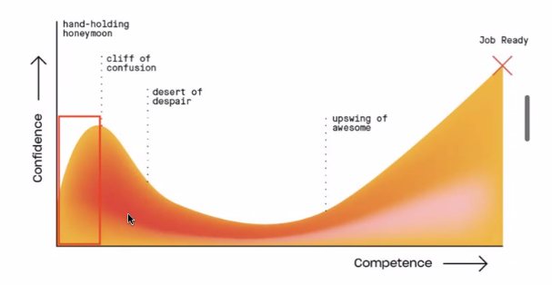

## 프로그래밍은 왜 어려울까?

- 프로그래밍은 원래 쉽지 않아요.
- 컴퓨터와 사람은 사고/인지 방식이 다릅니다. 사람의 관점이 아닌 컴퓨터의 관점에서 사고하는 것을 강요하는 Computational Thinking은 프로그래밍을 어렵게 느기게 하는 이유 중 하나입니다.
  > **Computational thinking**  
  > 분해 -> 추상화 -> 패턴 인식 -> 알고리즘
- 지나치게 긍정적인 희망과 높은 기대치는 절망으로 이어지고 학습을 포기하게 만듭니다.
- 프로그래밍 학습의 시작은 프로그래밍은 원래 쉽지 않다는 것을 **인정**하는 것입니다.
  - 어렵기때문에 학습에 시간이 걸립니다.
    - 시간을 많이 투입하면 빨리 성장하겠지만 그래도 단기간에 급성장하기는 어려울 수 있어요.
  - 진입 장벽이 어느 정도 있는 편이기 때문에 타 업종과 비교할 때 대우가 좋은 편입니다.
    - 어느 정도의 진입 장벽이 있다는 것은 유리한 면도 있어요.

## 프로그래밍은 어떻게 공부하는 것이 효율적일까요?

- "효율적인 학습 방법"은 무엇을 의미할까요?
  - 최소 비용 최대 효과의 원칙("가장 적은 노력으로 가장 큰 효과를")이 통할까?
- 투입 시간과 성장은 비례합니다.
  - 재능보다 **투입 시간**이 성장에 더 중요합니다.
  - **제대로** 공부하면 반드시 성장합니다!
  - 단, **방향**은 중요합니다.
    > 방향이 틀리면 속도는 아무런 의미가 없다. -_간디_
  - 이웅모 강사님 왈) **하루에 10시간, 일주일에 60시간 공부해야된다...** / 최선을 다해야된다.

## 프로그래밍 수련법

- 여러분의 목표가 무엇입니까?
  1. 취업 => 프로 => 능력 (경쟁 ○ => 남들보다 잘해야 한다.)
  2. 취미 => 아마추어 => 재미있으면 된다. (경쟁 X)
- 프로와 아마추어는 훈련법이 다를 수 밖에 없다.
  - 아마추어를 위한 교육 => 재미있고 쉽게
  - 프로를 위한 교육 => 능력 향상
- 재미있고 쉬운 학습법은 과연 존재하는가?

**[Coding Confidence ⚔ Competence]**

## 메타 인지

- 메타 인지(meta cognition)란 "자신이 알고 있는지 모르고 있는지, 모른다면 무엇을 모르는지 아는 것"을 의미합니다.

  > 예를 들어, 수영을 한 달 배운 사람이 "나는 100m를 완주할 수 있는가"를 스스로 판단하고, 만약 완주할 수 없다면 나에게 부족한게 체력인지 기술인지를 스스로 판단하는 데에 메타 인지가 사용된다. 메타 인지 능력이 높다면 자신의 능력과 한계를 더욱 정확히 파악해 시간과 노력을 필요한 곳에 적절히 투자하므로 학습 효율성이 높아진다.

- 무엇을 모르는지 아는 것

- 안다고 착각하는 것이 문제입니다.

- **말로 설명하지 못한다면 모르는 것입니다.**

- 러버덕 디버깅
  러버덕 디버깅은 "실용주의 프로그래머"라는 책에서 시작된 개념입니다. 이 책은 1999년에 데이비드 토머스와 앤드류 헌트가 공동 저술한 실용적인 프로그래밍에 관한 책으로, 프로그래머들이 더 나은 개발자로 성장하는데에 도움을 주는 내용을 다루는데 그 중 하나가 바로 러버덕 디버깅입니다.

개발자가 코드에서 버그를 찾고 해결하기 위해 마치 자신 앞에 있는 러버덕에게 문제를 설명하듯이 코드를 따라가며 버그를 찾아내는 것을 말합니다.
