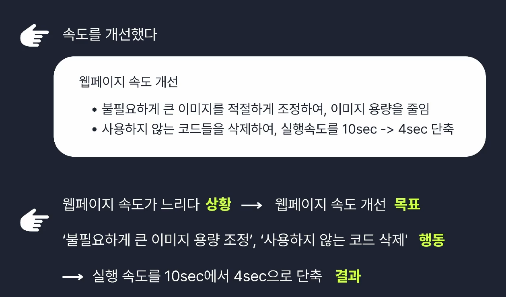

# 경험 분석 가이드

## 나의 일 가치관 발견하기

일 가치관에 영향을 주는 7가지 요소

- 성장
- 재미
- 조직문화
- 보상(연봉)
- 업무환경
- 인정
- 의미와 비전

## 경험 리스트 업

이때 중요한 것은 **'검열하지 않는 것'**
모든 경험은 의미와 가치가 있다. 거창하고 커다란 것이 아니다.

## 경험 재료 분석하기 (START 기법으로)

### 우선순위 경험 선별 기준

- 직무 연관성이 높은 경험
- 기여도가 높았거나 무언가를 끝까지 해 본 경험
- 좋은 성과가 있었던 경험
- 무언가를 개선해 본 경험

### START

- Situation(상황)
- Task(역할과 문제)
- Action(행동)
- Result(결과)
- Taken(교훈)

## 경험 속 나의 강점 발견하기

강점의 구분

- 하드 스킬 : 전문 기술
- 소프트 스킬 : 커뮤니케이션

### 면접관은 이런 질문을 던질 수 있습니다.

- 왜 우리가 지원자를 뽑아야 할까요?
- 강점이 뭔가요?

### 답하려면 세가지 요소가 필요

- 회사를 이해해야 합니다. (꼼꼼한 채용 분석)
- 나의 강점을 이해하고 설명

### 강점 키워드 리스트

- 직무 전문성
- 책임감
- 팀워크.소통
- 끈기
- 도전.열정
- 분석력
- 주도성.추진력
- 체계화.계획성
- 글로벌

### 태니지먼트 강점 검사 리포트 활용!

## 경험 구조화 작성하기

1. 프로젝트
   프로젝트 명은 한 줄 제목으로
2. 개요
   프로젝트의 목적과 소개를 간단히 설명
3. 팀/개인 프로젝트 구분

- 팀 프로젝트인지, 개인 프로젝트인지 구분
- 대략적인 팀 구성 소개

4. 프로젝트 내용

- 자신이 맡은 역할
- 직면한 문제 / 해결하기 위해 실행한 액션

5. 성과
6. 교훈
   프로젝트를 통해 배운점, 깨달은 점

예시

> 이런 문제 혹은 에러를 만났는데 **이런 과정**을 통해서 **어떻게** 해결했다는 **고민과 실행의 흔적**이 드러나야 합니다.

## 긍정적인 집념

불안을 느낄 때, 부정적이고 단편적인 사고는 우리의 가능성을 제한한다.

> *대충이라는 한 끗 차이*가 큰 격차를 만듭니다.  
> 대충 열심히하면 늘 운이 오기만 기다려야 하지만,  
> **정확하게 하면 반드시 때는 옵니다.**
